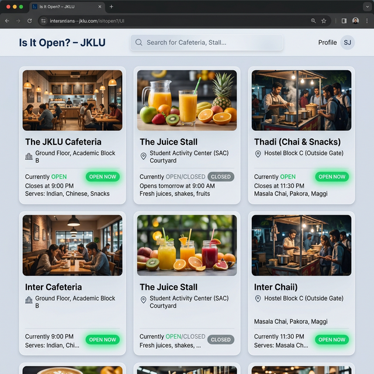
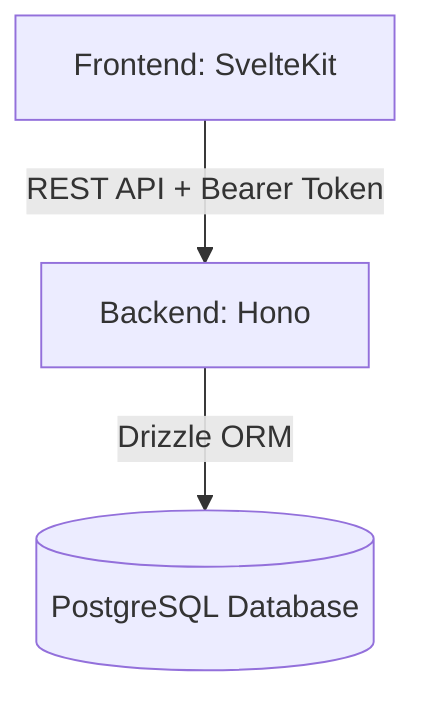

# Is It Open? – JKLU 🕒

**Is It Open? – JKLU** is a full-stack web application designed for the JK Lakshmipat University campus. It provides a real-time status tracker for campus businesses, allowing students to check if their favorite cafeterias, thadis, or juice stalls are currently open and what's on the menu.

---

## 🚀 Project Overview

The motivation behind this project is to solve a common campus problem: walking all the way to a cafeteria only to find it closed. 

Students can check the live status of every business on campus from their phones, including custom status messages (e.g., "Fresh dosa available!") and menu availability. Business owners can maintain their own digital presence, toggling their status and managing their menu with a single click.

---

## 🖼️ UI Preview


*(Mockup representation of the student dashboard)*

---

## 🏗️ System Architecture

The application follows a modern decoupled architecture:



- **Frontend (SvelteKit)**: A reactive, performant SPA built with Svelte 5 and Shadcn.
- **Backend API (Hono)**: A high-speed API server running on the Bun runtime.
- **Database (PostgreSQL)**: Reliable relational storage for users, businesses, and menu items.

---

## 🛠️ Tech Stack

### Frontend
- **Framework**: SvelteKit (Svelte 5 Runes)
- **Data Fetching**: TanStack Query
- **Styling**: TailwindCSS v4
- **Components**: Shadcn/ui
- **Type Safety**: TypeScript

### Backend
- **Runtime**: Bun
- **Framework**: Hono
- **ORM**: Drizzle ORM
- **Database**: PostgreSQL (via Docker)
- **Auth**: Better Auth

---

## ✨ Key Features

- **Real-time Status**: Instant updates for "Open/Closed" states across the campus.
- **Dynamic Menus**: View items and their current availability (In Stock / Out of Stock).
- **Owner Dashboard**: Dedicated management portal for business owners.
- **Status Expiry**: Status messages automatically clear after 12 hours to ensure info remains fresh.
- **Token-based Auth**: Secure Bearer token authentication for all owner actions.

---

## 📁 Project Structure

```text
root/
 ├ backend/    # Bun + Hono + Drizzle API
 └ frontend/   # SvelteKit + Tailwind v4 Web App
```

---

## 🚦 Getting Started

### Prerequisites
- [Bun](https://bun.sh/) installed.
- [Node.js](https://nodejs.org/) (optional, for frontend npm commands).
- [Docker](https://www.docker.com/) for running the database.

### Setup Instructions

1. **Backend Setup**:
   ```bash
   cd backend
   bun install
   docker-compose up -d  # Starts PostgreSQL
   bun run migrate       # Pushes schema to DB
   bun run dev           # Starts API at http://localhost:3000
   ```

2. **Frontend Setup**:
   ```bash
   cd frontend
   npm install
   npm run dev           # Starts web app at http://localhost:5173
   ```

---

## 🔮 Future Improvements

- **Push Notifications**: Notify students when a business opens or has special deals.
- **Mobile App**: A dedicated React Native or Svelte Native application.
- **Analytics**: Insights for owners on peak hours and popular items.
- **Global Search**: Filter businesses by cuisine or specific products.

---

## 📄 License
MIT License. Created for the JKLU Campus.
